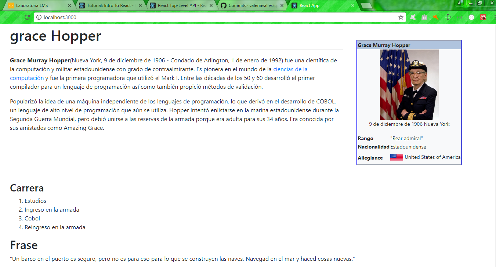

## Grace Hopper React

En esta ocasion se hiso una replica de una pagina web 
con la biografia de grace hopper usando la estructura HTML5  a traves de componentes de React js.

Se separo los componentes en tres partes el Main, Aside y content, gracias al JSX nos permite escribir como una estructura html pero desde el js.

Para ello inicializamos nuestro proyecto 
con el siguiente comandos :

+ npm install -g create-react-app

### Vista de la Web

